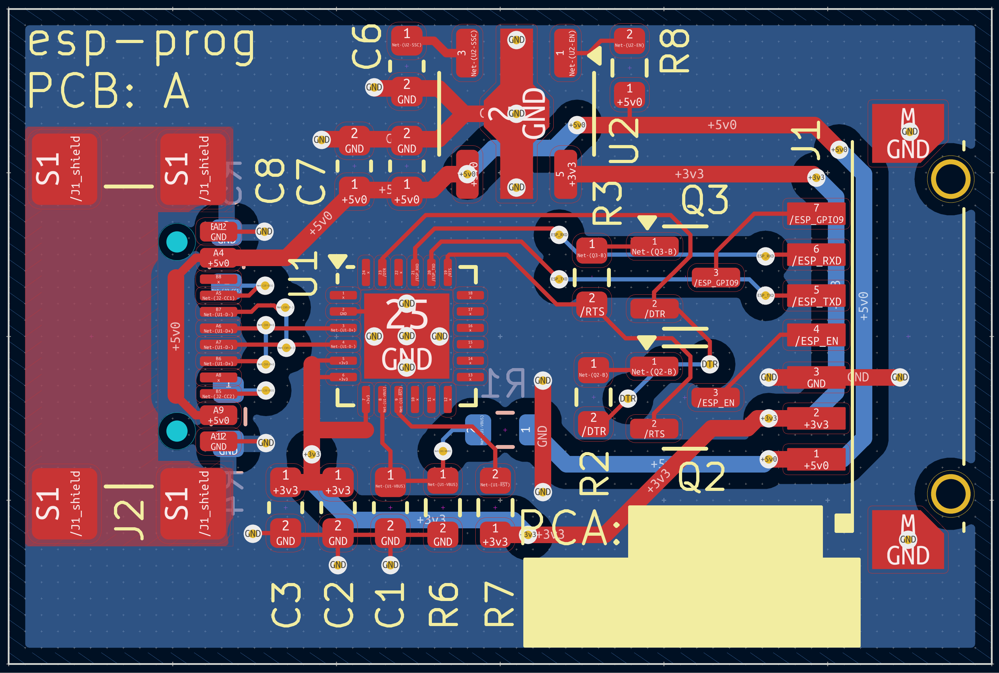
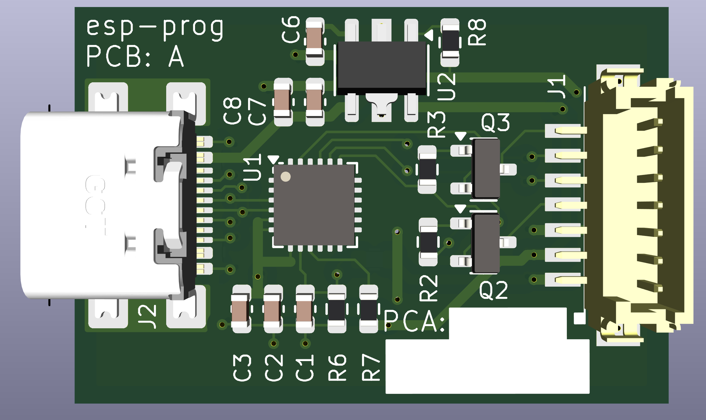

# esp-prog

esp32 programmer - USBC to custom DF13-7 connector

This is from the circuit on the ESP32-C6-DevKitC-1 board from Espressif.  It
includes the USB-UART, BJT translators for reset and boot mode, and a 3.3V LDO.

* Full kicad sources included
* Tested by flashing ESP32-C6-WROOM-1-N8 module using 

## images

## PCA BOM

DigiKey buy list for the PCA (was $11.66 at time of writing) - NOTE: this
is for PCA only.  No target or PC (USB-C) cable parts included:
[http://www.digikey.com/en/mylists/list/WV3N0IXJLB](http://www.digikey.com/en/mylists/list/WV3N0IXJLB)

## PC Cable

The CP2102N is a USB 2.0 full-speed (12 Mbit/s) device, so any USB-C cable with
data lanes should work.

## Target Cable

DigiKey buy list for cable (was $7.54 at time of writing):
[http://www.digikey.com/en/mylists/list/WWA0BU113L](http://www.digikey.com/en/mylists/list/WWA0BU113L)

DF13-7S-1.25C, qty 2:
[http://www.digikey.com/en/products/detail/hirose-electric-co-ltd/DF13-7S-1-25C/241754](http://www.digikey.com/en/products/detail/hirose-electric-co-ltd/DF13-7S-1-25C/241754)

H4BBG-10104-B6, qty 10:
[http://www.digikey.com/en/products/detail/hirose-electric-co-ltd/H4BBG-10104-B6/425553](http://www.digikey.com/en/products/detail/hirose-electric-co-ltd/H4BBG-10104-B6/425553)

Route pin 1 to pin1, and pin 7 to pin 7.  With the pre-crimped wires from
Digi-Key, the cable will want to lay with both connectors facing the same
direction, with a half-twist in the middle.  With the wires all laying flat and
in parallel, one connector will be up while the other is down.
